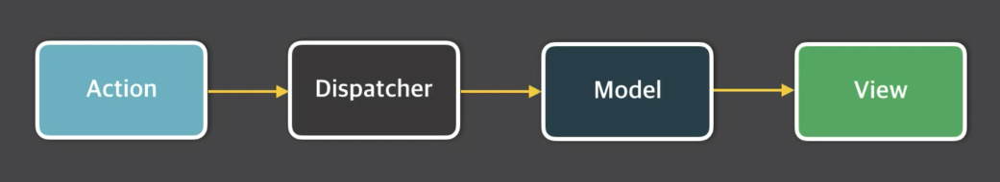
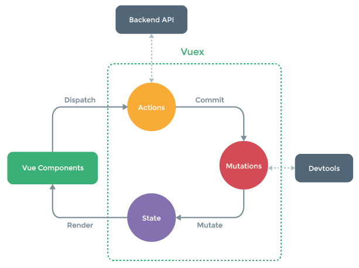

# Vuex

## Vuex란?

- 무수히 많은 컴포넌트의 데이터를 관리하기 위한 상태 관리 패턴이자 라이브러리
- React의 `Flux` 패턴에서 기인

## Flux란?

- MVC 패턴의 복잡한 데이터 흐름 문제를 해결하는 개발 패턴 _Unidirectional data flow_

  - 모든 데이터 흐름이 한 방향으로 진행됨

- Flux가 나오게 된 배경 : [Facbook Hacker Way: Rethinking Web App Development at Facebook](https://www.youtube.com/watch?v=nYkdrAPrdcw)



1. `action` : 화면에서 발생하는 이벤트 또는 사용자의 입력
2. `dispatcher : 데이터를 변경하는 방법, 메서드
3. `model` : 화면에서 표시할 데이터
4. `view`: 사용자에게 비춰지는 화면

### MVC와 Flux

1. MVC
   

   1. MVC 패턴

      - View : 화면
      - Controller : Model, View 제어
      - Model : 데이터

   2. MVC 패턴의 문제점
      - 기능 추가 및 변경에 따라 생기는 문제점을 예측할 수가 없음
      - 앱이 복잡해지면서 생기는 업데이트 루프
      - 한 모델에 대해 여러 뷰가 접근을 하는 경우가 다수 발생 → 모델과 뷰의 의존성이 복잡해짐 : side effect 정도를 파악하기 어려움

2. Flux
   
   - 데이터의 흐름이 여러 갈래로 나뉘지 않고 단방향으로 처리

## Vuex가 왜 필요할까?

- 복잡한 애플리케이션에서 컴포넌트의 개수가 많아지면 컴포넌트 간에 데이터 전달이 어려워진다.

### 이벤트 버스로 해결?

- 어디서 이벤트를 보냈는지 혹은 어디서 이벤트를 받았는지 알기 어려움

```js
// Login.vue
eventBus.$emit("fetch", loginInfo);

// List.vue
eventBus.$emit("display", (data) => this.displayOnScreen(data));

// Chart.vue
eventBus.$emit("refreshData", charData);
```

**컴포넌트 간 데이터 전달이 명시적이지 않음**

### Vuex로 해결할 수 있는 문제

1. MVC 패턴에서 발생하는 구조적 오류
2. 컴포넌트 간 데이터 전달 명시
3. 여러 개의 컴포넌트에서 같은 데이터를 업데이트 할 때 동기화 문제

## Vuex 컨셉

- State : 컴포넌트 간에 공유하는 데이터 `data()`
- View : 데이터를 표시하는 화면 `template`
- Action : 사용자의 입력에 따라 데이터를 변경하는 `methods`

View -> Action -> State -> View -> ...

## Vuex 구조

> 컴포넌트 -> 비동기 로직 -> 동기로직 -> 상태



- Action은 비동기 로직이라고 보면 됨
- Action에서 Mutation 호출 : Mutation이 데이터 변경

## Vuex 설치

- Vuex는 싱글파일 컴포넌트 체계에서 npm 방식으로 라이브러리 설치 권장

```
npm install vuex --save
```

_ES6와 함께 사용해야 더 많은 기능과 이점 제공받을 수 있음_

## Vuex 기술요소

- state : 여러 컴포넌트에 공유되는 데이터 `data`
- getters : 연산된 state 값을 접근하는 속성 `computed`
- mutations : <u>state 값을 변경</u>하는 이벤트 로직, 메서드 `methods`
- actions : 비동기 처리 로직을 선언하는 메서드 `async methods`

### State란?

- 여러 컴포넌트 간에 공유할 데이터 **상태**

```js
//Vue
data: {
  message: "Hello Vue.js";
}

// Vuex
state: {
  message: "Hellow Vue.js";
}
```

```html
<!-- Vue -->
<p>{{ message }}</p>

<!-- Vuex -->
<p>{{ this.$store.state.message }}</p>
```

### getters란?

- state 값을 접근하는 속성이자 `computed()` 처럼 미리 연산된 값을 접근하는 속성

```js
// store.js
state: {
    num: 10
},
getters: {
    getNumber(state) {
        return state.num;
    },
    doubleNumber(state) {
        return state.num * 2;
    }
}
```

```html
<p>{{ this.$store.getters.getNumber }}</p>
<p>{{ this.$store.getters.doubleNumber }}</p>
```

### mutations란?

- state의 값을 변경할 수 있는 **유일한 방법**이자 메서드
- mutation은 `commit()`으로 동작시킨다

```js
// store.js
state: { num: 10 },
mutations: {
    printNumbers(state) {
        return state.num
    },
    sumNumbers(state, anotherNum) {
        return state.num + anotherNum;
    }
}

// App.vue
this.$store.commit('printNumbers')
this.$store.commit('sumNumbers', 20)
```

#### mutations의 commit() 형식

- state를 변경하기 위해 mutations를 동작시킬 때 인자(payload)를 전달할 수 있음

```js
// store.js
state: { storeNum: 10 },
mutations: {
    modifyState(state, payload) {
        console.log(payload.str);
        return state.storeNum += payload.num;
    },
}

// App.vue
this.$store.commit('modifyState', {
    str: "passed from payload",
    num: 20
});
```

#### state는 왜 직접 변경하지 않고 mutations로 변경?

1. 여러 개의 컴포넌트에서 아래와 같이 state 값을 변경하는 경우 **어느 컴포넌트에서 해당 state를 변경했는지 추적 어려움**

   ```js
   methods: {
       increseCount() { this.$store.state.count++; }
   }
   ```

2. 특정 시점에 어떤 컴포넌트가 state를 접근해 변경한건지 확인하기 어렵기 때문
3. 따라서, 뷰의 반응성을 거스르지 않게 명시적으로 상태 변화를 수행. **반응성, 디버깅, 테스팅 혜택**

### actions

- **비동기 처리 로직**을 선언하는 메서드. 비동기 로직을 담당하는 mutations
- 데이터 요청, Promise, ES6 async와 같은 비동기 처리는 모두 actions에 선언

```js
// store.js
state: {
    num: 10
},
mutations: {
    doubleNumber(state) {
        state.num * 2;
    },
},
actions: {
    delayDoubleNumber(context) { // context로 store의 메서드와 속성 접근
        context.commit('doubleNumber');
    }
}

// App.vue
this.$store.dispatch('delayDoubleNumber');
```

비동기 코드 예제 1

```js
// store.js
mutations: {
    addCounter(state) {
        state.count++;
    },
},
actions: {
    delayedAddCounter(context) {
        setTimeout(() => context.commit('addCounter'),2000);
    }
}

// App.vue
methods: {
    incrementCount() {
        this.$store.dispatch('delayedAddCounter');
    }
}
```

비동기 코드 예제 2

```js
// store.js
mutations: {
    setData(state, fetchedData) {
        state.product = fetchedData;
    },
},
actions: {
    fetchProductData(context) {
        return axios.get("https://domain.com/products/1")
                .then(response => context.commit("setData", response));
    }
}

// App.vue
methods: {
    incrementCount() {
        this.$store.dispatch('fetchProductData');
    }
}
```

#### 왜 비동기 처리 로직은 actions에 선언해야 하는가?

- 언제 어느 컴포넌트에서 해당 state를 호출하고, 변경했는지 확인하기가 어려움

  > 결론 : state 값의 변화를 추적하기 어렵기 때문에 mutations 속성에는 동기 처리 로직만 넣어야 한다.

## Vuex Helper

- 각 속성들을 더 쉽게 사용하는 방법
  - state → mapState
  - getters → mapGetters
  - mutations → mapMutations
  - actions → mapActions

### 헬퍼 사용법

- 헬퍼를 사용하고자 하는 vue 파일에서 아래와 같이 해당 헬퍼를 로딩

```js
// App.vue
import { mapState } from 'vuex'
import { mapGetters } from 'vuex'
import { mapMutations } from 'vuex'
import { mapActions } from 'vuex'

export default {
    computed() { ...mapState(['num']), ...mapGetters(['countedNum']) },
    methods() { ...mapMutations(['clickBtn']), ...mapActions(['asyncClickBtn']) }
}
```

★ `...` ?

- ES6의 Object Spread Operator

```js
let josh = {
  field: "web",
  language: "js",
};

let developer = {
  nation: "korea",
  ...josh,
  // field: josh.field,
  // language: josh.language
};

console.log(developer);
// {
//     nation: "korea",
//     field: "web",
//     language: "js",
// }
```

### mapState

- Vuex에 선언한 state 속성을 뷰 컴포넌트에 더 쉽게 연결해주는 헬퍼

```js
// App.vue
import { mapState } from 'vuex'

computed() {
    ...mapState(['num'])
    // num() { return this.$store.state.num; }
}

// store.js
state: {
    num: 10
}
```

```html
<!-- <p>{{ this.$store.state.num }}</p> -->
<p>{{ this.num }}</p>
```

### mapGetters

- Vuex에 선언한 getters 속성을 뷰 컴포넌트에 더 쉽게 연결해주는 헬퍼

```js
// App.vue
import { mapGetters } from 'vuex'

computed() { ...mapGetters(['reverseMessage']) }

// store.js
getters: {
    reverseMessage(state) {
        return state.msg.split('').reverse().join('');
    }
}
```

```html
<!-- <p>{{ this.$store.getters.reverseMessage }}</p> -->
<p>{{ this.reverseMessage }}</p>
```

### mapMutations

- Vuex에 선언한 mutations 속성을 뷰 컴포넌트에 더 쉽게 연결해주는 헬퍼

```js
// App.vue
import { mapMutations } from "vuex";

methods: {
    ...mapMutations(['clickBtn']),
    authLogin() {},
    displayTable() {}
}

// store.js
mutations: {
    clickBtn(state) {
        alert(state.msg);
    }
}
```

```html
<button @click="clickBtn">popup message</button>
```

### mapActions

- Vuex에 선얺나 acrions 속성을 뷰 컴포넌트에 더 쉽게 연결해주는 헬퍼

```js
// App.vue
import { mapActions } from "vuex";

methods: {
    ...mapActions(['delayClickBtn']),
}

// store.js
actions: {
    delayClickBtn(context) {
        setTimeout(() => context.commit('clickBtn'), 2000);
    }
}
```

```html
<button @click="delayClickBtn">delay popup message</button>
```

## 헬퍼의 유연한 문법

- Vuex에 선언한 속성을 그대로 컴포넌트에 연결하는 문법

```js
// 배열 리터럴
...mapMutaions([
    'clickBtn', // 'clickBtn' : clickBtn
    'addNumber' // addNumber(인자)   --> string에 인자를 설정 안해도 인자 넘겨보낼 수 있음.
])
```

- Vuex에 선언한 속성을 컴포넌트의 특정 메서드에다가 연결하는 문법

```js
// 객체 리터럴
...mapMutaions({
    popupMsg: 'clickBtn', // 컴포넌트 메서드 명 : Store의 Mutation 명
})
```

## 프로젝트 구조화와 모듈화 방법 1

### AS-IS

- 내부 로직이 길어질 경우 복잡해짐

```js
// store.js
import Vue from "vue";
import Vuex from "vuex";

export const store = new Vuex.Store({
  state: {},
  getters: {},
  mutations: {},
  actions: {},
});
```

### TO-BE

- ES6의 `Import` & `Export`를 이용해 속성별로 모듈화

```js
// store.js
import Vue from "vue";
import Vuex from "vuex";
import * as getters from "store/getters.js";
import * as mutations from "store/matations.js";
import * as actions from "store/actions.js";

export const store = new Vuex.Store({
  state: {},
  getters: getters,
  mutations: mutations,
  actions: actions,
});
```
